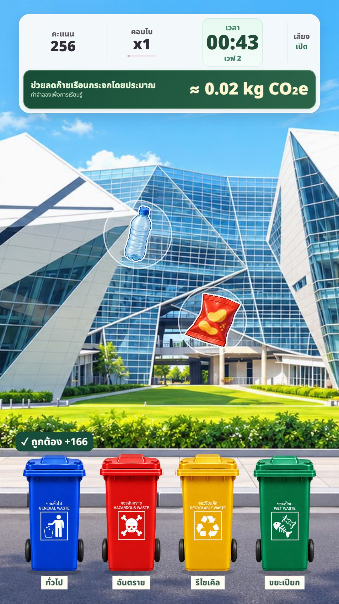
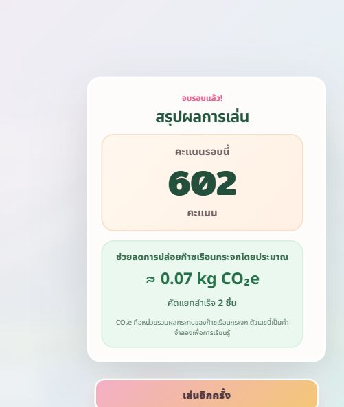

# Click to Save the Planet

**เกมคัดแยกขยะภาษาไทยที่เหมาะสำหรับจอบูทแนวตั้ง 9:16 (แนะนำ 1080×1920)** ออกแบบหน้า Main Menu ให้ครบในจอเดียว พร้อมปุ่มขนาดเหมาะกับหน้าจอสัมผัส แยกขยะให้ถูกประเภท ทำคะแนนและคอมโบให้สูงที่สุดในเวลา 75 วินาที

## เล่นออนไลน์

- **[เปิดเกม](https://nanthawatkhom-creator.github.io/Click-to-Save-the-Planet/)**
- **[เปิดหน้าโชว์สแตนดี้](https://nanthawatkhom-creator.github.io/Click-to-Save-the-Planet/standee.html)**

## วิธีเล่น

1. ใส่ **ชื่อเล่น** แล้วกด **เริ่มเกม** หรือ Enter
2. ลองแยกขยะในบทสอนสั้น ๆ ก่อนเริ่มจับเวลา
3. ลากขยะลงถังให้ตรงประเภท: ขยะทั่วไป รีไซเคิล ขยะเปียก และขยะอันตราย
4. ทำคะแนนและคอมโบให้สูงที่สุดภายใน 75 วินาที

ในเกมนี้ลากขยะลงถังที่ตรงประเภทได้ทันที ทุกเวฟใช้กติกาเดียวกัน ไม่มีจุดล้างหรือขั้นตอนล้างของก่อนทิ้ง

### ภาพระหว่างเล่น

ภาพจากการเล่นจริงในเลย์เอาต์จอบูทแนวตั้ง แสดงคะแนน เวลา คอมโบ และค่าลดก๊าซเรือนกระจกจำลองระหว่างคัดแยกขยะ

ภาพเมนูเวอร์ชันก่อนหน้า

เล่นได้ด้วยเมาส์หรือหน้าจอสัมผัส มีโหมดบูทจอแนวตั้ง 9:16 เช่น 1080×1920 โดยจัดหน้าเริ่มเกมให้ครบในจอเดียว ปรับขนาดปุ่มและวัตถุตามพื้นที่จอ และรองรับการลดการเคลื่อนไหวตามการตั้งค่าเบราว์เซอร์ แนะนำ Chrome หรือ Edge และกด `F11` เพื่อแสดงผลเต็มจอที่บูท

หน้าเมนูมีปุ่ม **ลูกเล่น: เปิด/ปิด** ที่มุมขวาบน ใช้เปิดมาสคอตลอย ใบไม้ และประกายขยับได้ แม้เครื่องจะตั้งค่าลดการเคลื่อนไหวไว้ โดยจำตัวเลือกเฉพาะเบราว์เซอร์ที่เล่น หากยังไม่เลือกเอง เกมจะใช้การตั้งค่าการเคลื่อนไหวของเครื่อง

ระหว่างเล่น จะแสดงค่าลดก๊าซเรือนกระจกโดยประมาณบนแถบข้อมูล ตัวเลขเป็นค่าจำลองเพื่อการเรียนรู้ เมื่อแยกถูกจะมีแสงสีเขียวและประกายที่ถัง ส่วนการใส่ผิดถังจะแสดงขอบจอสีแดงสั้น ๆ พร้อมข้อความแจ้งคะแนน ข้อความนับถอยหลังและผ่านเวฟใช้พื้นสีเข้มเพื่อให้อ่านชัด

## สรุปผลหลังจบรอบ

เมื่อหมดเวลา เกมแสดงคะแนนของรอบนั้น จำนวนขยะที่คัดแยกสำเร็จ และค่าลดการปล่อยก๊าซเรือนกระจกโดยประมาณในหน่วย kg CO₂e ตัวเลขด้านสิ่งแวดล้อมเป็นค่าจำลองเพื่อการเรียนรู้ ไม่ใช่การวัดผลการลดก๊าซจริง

หน้าสรุปแสดงชื่อผู้เล่น คะแนน และอันดับของรอบนั้นเมื่อคะแนนติด 10 อันดับสูงสุด กด **ดู Leaderboard** เพื่อดูอันดับ หรือ **เล่นอีกครั้ง** เพื่อกลับหน้าเมนูและใส่ชื่อผู้เล่นคนถัดไป

ภาพหน้าสรุปก่อนนำระบบชื่อและ Leaderboard กลับมา

## Leaderboard ของเครื่องนี้

- เปิดได้จากปุ่ม **ดู Leaderboard** ในหน้าเมนูและหน้าสรุปผล
- เก็บ **10 รอบที่ได้คะแนนสูงสุด** พร้อมชื่อเล่น คะแนน จำนวนขยะที่แยกสำเร็จ และค่าลดก๊าซเรือนกระจกจำลอง
- ข้อมูลบันทึกเป็น **Cookie ในเครื่องและเบราว์เซอร์ที่เล่น** อายุสูงสุด 1 ปีนับจากการบันทึกล่าสุด คะแนนของแต่ละเครื่อง เบราว์เซอร์ หรือโปรไฟล์จึงแยกกัน
- คะแนนเท่ากันจะเรียงตามค่าลดก๊าซเรือนกระจกจำลอง และเวลาบันทึกตามลำดับ ชื่อซ้ำกันได้เพราะจัดอันดับแต่ละรอบการเล่น
- การล้าง Cookie หรือใช้โหมดส่วนตัวอาจทำให้อันดับหาย หาก Cookie ถูกบล็อก เกมจะแจ้งว่าเก็บอันดับได้ชั่วคราวจนปิดหน้าเกม
- หากเบราว์เซอร์เดิมยังมีคะแนนจาก Leaderboard เวอร์ชันเก่า เกมจะนำ 10 อันดับสูงสุดกลับมาใช้เมื่ออ่านข้อมูลนั้นได้

## หน้าเมนูเกม

หน้า Main Menu ของเกมใช้ลูกเล่นชุดเดียวกัน: มาสคอตกระพริบตา/โบกมือ/ดีใจ วงแสงและละออง ใบไม้ปลิวเป็นเส้นโค้ง แสงบนโลโก้ และประกายรอบภาพ SDG ต้นฉบับ ปุ่ม **ลูกเล่น** ที่มุมขวาบนเปิดหรือปิดการเคลื่อนไหวทั้งหมดได้ และหน้าเมนูจะพักการเคลื่อนไหวเมื่อเข้าเล่นเกมหรือเปิด Leaderboard

## หน้าโชว์แบบสแตนดี้

เปิด `standee.html` สำหรับแสดงที่บูท เป็นหน้าโชว์แนวตั้ง 9:16 ที่มีชื่อเกม มาสคอตโลกน้อยขยับเบา ๆ ใบไม้ลอย และประกาย ชวนผู้ชม “ท้าแยกขยะ พิชิตคะแนนสูงสุด!” พร้อมข้อความเรียนรู้และ SDG 12–13 ขนาดใหญ่บนพื้นสว่าง โดยใช้ภาพ SDG ต้นฉบับในแถวคำอธิบายด้านล่าง หน้านี้ไม่มีถังขยะ ช่องกรอกชื่อ ปุ่มเริ่มเกม หรือปุ่มดู Leaderboard การเคลื่อนไหวจะหยุดเมื่อระบบตั้งค่าลดภาพเคลื่อนไหว หรือสั่งพิมพ์

จากหน้าเมนูเกม กดปุ่มเล็ก **หน้าโชว์สแตนดี้** ที่มุมซ้ายบน หรือเปิด [ลิงก์สแตนดี้โดยตรง](https://nanthawatkhom-creator.github.io/Click-to-Save-the-Planet/standee.html) บนจอโชว์ แล้วกด `F11` เพื่อเต็มจอ หน้าโชว์ย่อขยายทั้งภาพตามจอ และอยู่ครบในหน้าเดียว

ลูกเล่นหน้าโชว์มี 5 ส่วน: วงแสงสีเขียวและละอองรอบมาสคอต, ท่ากระพริบตา/โบกมือ/ดีใจจากภาพมาสคอต 6 ท่า, ใบไม้ปลิวเป็นเส้นโค้ง, แสงวิ่งผ่านโลโก้ และประกายสีทอง/เขียวรอบแถว SDG ที่สลับกันช้า ๆ ข้อความและภาพ SDG ต้นฉบับอยู่กับที่เพื่อให้อ่านง่าย เมื่อสลับไปแท็บอื่นหน้าโชว์จะพักการเคลื่อนไหว รายละเอียดภาพที่สร้างและพรอมป์ต์อยู่ใน [บันทึก asset มาสคอต](media/standee-mascot-effects-prompts.md)

## เทคโนโลยี

- HTML, CSS และ JavaScript
- Phaser 3 สำหรับเกม
- Howler.js สำหรับเสียง
- GitHub Pages สำหรับเผยแพร่

## เปิดเล่นบนเครื่อง

ดาวน์โหลดหรือ clone Repository แล้วเปิด `RUN_GAME.cmd` บน Windows จากนั้นเข้า `http://127.0.0.1:8080/` เกมโหลด Phaser, Howler และฟอนต์จาก CDN จึงต้องเชื่อมต่ออินเทอร์เน็ตขณะเล่น

## Repository

- โค้ดเกมและไฟล์ README: [github.com/nanthawatkhom-creator/Click-to-Save-the-Planet](https://github.com/nanthawatkhom-creator/Click-to-Save-the-Planet)
- เว็บไซต์เกม: [nanthawatkhom-creator.github.io/Click-to-Save-the-Planet](https://nanthawatkhom-creator.github.io/Click-to-Save-the-Planet/)

### พรีวิวจอบูทบนคอมพิวเตอร์

เมื่อเปิดเซิร์ฟเวอร์ในเครื่อง ให้เข้า `booth-preview.html` เพื่อแสดงเกมในกรอบ 1080×1920 ที่ย่อพอดีกับหน้าต่างและลองเล่นได้ ส่วนเครื่องบูทให้เปิดหน้าเกม `index.html` ตามปกติ เลย์เอาต์จะเลือกตามสัดส่วนจอจริง
