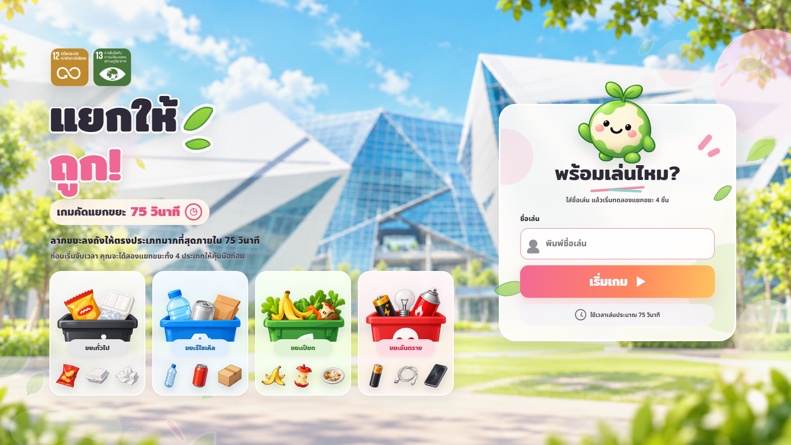

# Click to Save the Planet

**เกมคัดแยกขยะภาษาไทยที่เหมาะสำหรับจอบูทแนวตั้ง 9:16 (แนะนำ 1080×1920)** ออกแบบหน้า Main Menu ให้ครบในจอเดียว พร้อมปุ่มขนาดเหมาะกับหน้าจอสัมผัส แยกขยะให้ถูกประเภท ทำคะแนนและคอมโบให้สูงที่สุดในเวลา 75 วินาที

## เล่นออนไลน์

- **[เปิดเกม](https://nanthawatkhom-creator.github.io/trash-sorter-game/)**

## วิธีเล่น

1. ใส่ชื่อเล่น แล้วกด **เริ่มเกม**
2. ลองแยกขยะในบทสอนสั้น ๆ ก่อนเริ่มจับเวลา
3. ลากขยะลงถังให้ตรงประเภท: ขยะทั่วไป รีไซเคิล ขยะเปียก และขยะอันตราย
4. ทำคะแนนและคอมโบให้สูงที่สุดภายใน 75 วินาที

เล่นได้ด้วยเมาส์หรือหน้าจอสัมผัส มีโหมดบูทจอแนวตั้ง 9:16 เช่น 1080×1920 โดยจัดหน้าเริ่มเกมให้ครบในจอเดียว ปรับขนาดปุ่มและวัตถุตามพื้นที่จอ และรองรับการลดการเคลื่อนไหวตามการตั้งค่าเบราว์เซอร์ แนะนำ Chrome หรือ Edge และกด `F11` เพื่อแสดงผลเต็มจอที่บูท

ระหว่างเล่น จะแสดงค่าลดก๊าซเรือนกระจกโดยประมาณบนแถบข้อมูล ตัวเลขเป็นค่าจำลองเพื่อการเรียนรู้ เมื่อแยกถูกจะมีแสงสีเขียวและประกายที่ถัง ส่วนการใส่ผิดถังจะแสดงขอบจอสีแดงสั้น ๆ พร้อมข้อความแจ้งคะแนน ข้อความนับถอยหลังและผ่านเวฟใช้พื้นสีเข้มเพื่อให้อ่านชัด

## Leaderboard

เกมแสดงอันดับหลังจบรอบ และเก็บ 50 คะแนนสูงสุดไว้ในพื้นที่จัดเก็บข้อมูลของเบราว์เซอร์ (`localStorage`) บนอุปกรณ์ที่เล่น ลักษณะการเก็บจะคล้ายคุกกี้ คือข้อมูลอยู่กับเบราว์เซอร์และเครื่องนั้น ผู้เล่นหลายคนที่ผลัดกันเล่นบนเครื่องและเบราว์เซอร์เดียวกันจึงใช้อันดับร่วมกันได้ แต่คะแนนจะไม่ซิงก์ไปยังเครื่องหรือเบราว์เซอร์อื่น และอาจหายไปเมื่อผู้ใช้ล้างข้อมูลเว็บไซต์ของเบราว์เซอร์

หากต้องการอันดับออนไลน์ร่วมกัน ให้ตั้งค่า Firebase ตาม [FIREBASE_SETUP.md](FIREBASE_SETUP.md) และเปิดใช้ Firestore ก่อน ระบบ Firebase ยังไม่ได้เปิดใน Repository นี้

## เทคโนโลยี

- HTML, CSS และ JavaScript
- Phaser 3 สำหรับเกม
- Howler.js สำหรับเสียง
- GitHub Pages สำหรับเผยแพร่

## เปิดเล่นบนเครื่อง

ดาวน์โหลดหรือ clone Repository แล้วเปิด `RUN_GAME.cmd` บน Windows จากนั้นเข้า `http://127.0.0.1:8080/` เกมโหลด Phaser, Howler และฟอนต์จาก CDN จึงต้องเชื่อมต่ออินเทอร์เน็ตขณะเล่น

## Repository

- โค้ดเกมและไฟล์ README: [github.com/nanthawatkhom-creator/trash-sorter-game](https://github.com/nanthawatkhom-creator/trash-sorter-game)
- เว็บไซต์เกม: [nanthawatkhom-creator.github.io/trash-sorter-game](https://nanthawatkhom-creator.github.io/trash-sorter-game/)
- Portfolio: [nanthawatkhom-creator.github.io](https://nanthawatkhom-creator.github.io/)

### พรีวิวจอบูทบนคอมพิวเตอร์

เมื่อเปิดเซิร์ฟเวอร์ในเครื่อง ให้เข้า `booth-preview.html` เพื่อแสดงเกมในกรอบ 1080×1920 ที่ย่อพอดีกับหน้าต่างและลองเล่นได้ ส่วนเครื่องบูทให้เปิดหน้าเกม `index.html` ตามปกติ เลย์เอาต์จะเลือกตามสัดส่วนจอจริง
